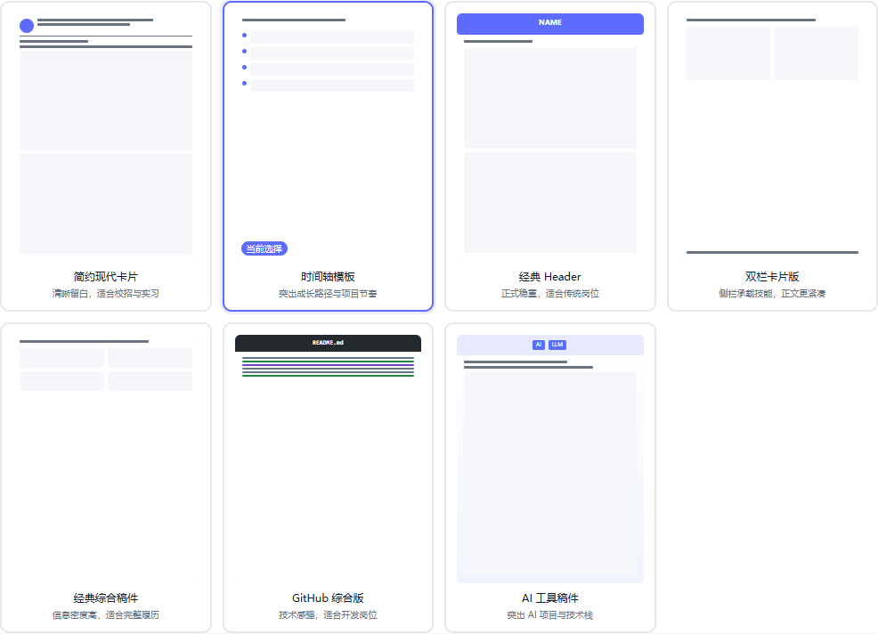
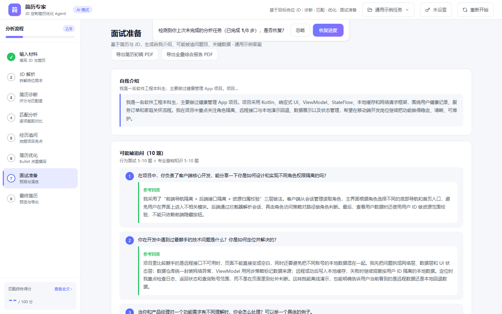
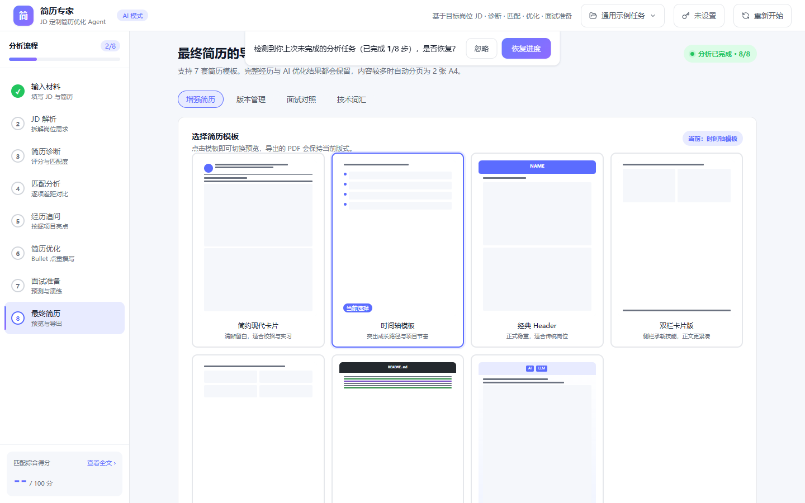
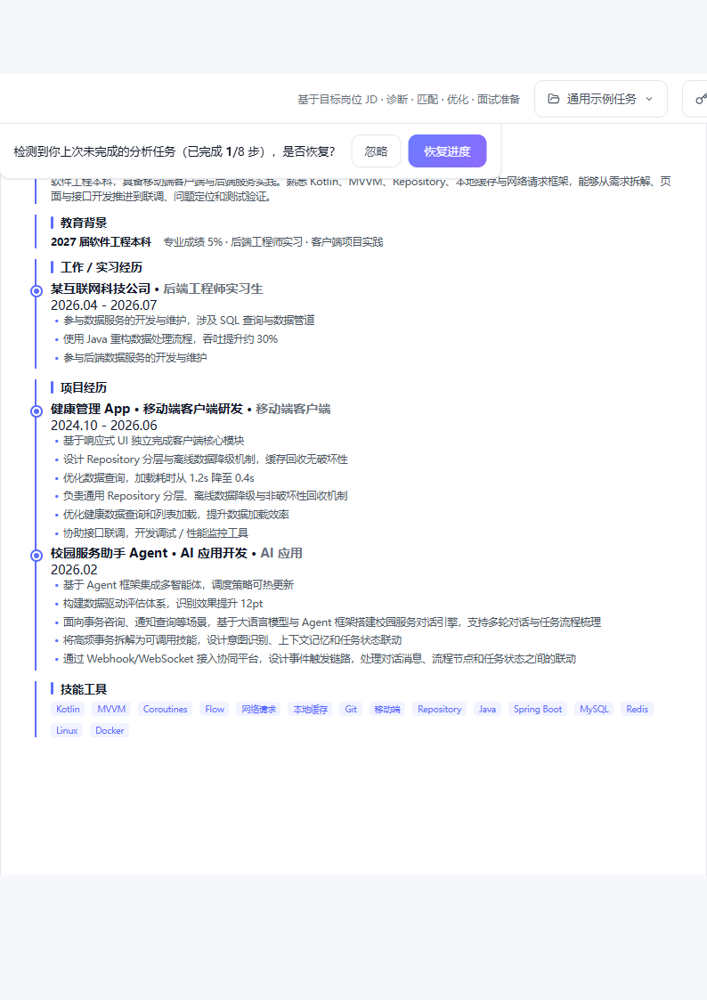

# 简历专家 · JD 定制简历优化 Agent

> 基于目标岗位 JD · 诊断 · 匹配 · 优化 · 面试准备

由 DeepSeek 驱动的纯前端 8 步简历定制流程，最终产出**多模板简历** + **完整面试准备材料**。所有用户数据保存在本机 localStorage，不上传服务器。

---

## 👀 效果一览

7 套简历模板，一份内容，按岗位风格切换：



---

## ✨ 功能亮点

### 🛤️ 完整 8 步流水线
输入材料 → JD 解析 → 简历诊断 → 匹配分析 → 经历追问 → 简历优化 → 面试准备 → **最终简历**

### 📋 多任务管理
顶部「任务」下拉菜单新建/切换/重命名/删除**多份分析任务**（如不同岗位/公司），数据完全隔离，`localStorage` v2 自动迁移旧版本。

### 🔀 简历版本对比
同一份简历保存多个定制版本（如「安卓方向」「后端方向」），并排 **diff 对比**，一键应用快照。

### 🔒 隐私脱敏（发送前 → 接收后自动还原）
手机号 / 邮箱 / 身份证 自动替换为占位符 `__PH:xxx__`，AI 返回后用内存 Map 还原嵌套结构（`restoreTree`）。

### 🎨 7 套简历模板
简约现代卡片 / 时间轴 / 经典 Header / 双栏卡片版 / 综合稿件 / GitHub README / AI 工具稿件 —— 全部紧凑 A4 单页排版。

### 📤 多种导出格式
复制精简文本 / PDF / Word / 全量综合报告 PDF / JD 解析 PDF。

### 🎓 本地洞察（无需 Token）
- **JD 关键词覆盖矩阵** — 命中 / 未命中 / 缺失关键词分类
- **面试回答训练评分** — 5 维度（内容实质 / 表达结构 / 题目相关 / 可信证据 / 个人判断）+ STAR 完整度

### 📂 通用示例数据
内置完全虚构的示例数据（健康管理 App 完整 8 步分析结果与面试参考答案），一键加载即可预览完整渲染效果，不含任何真实个人信息。

### 🔌 浏览器插件联动
Chrome 插件选中招聘网站 JD 一键发送 → 本地应用自动填入 + 跳转）。

### 🛟 状态恢复
- 未完成进度自动保存到 `localStorage`（v2 结构：多任务 + 多版本）
- 关闭浏览器再打开提示恢复上次进度
- 离线就绪（CDN 已缓存后无网络仍可访问主流程）

### 🧪 API Key 连通性测试
设置 Key 时一键验证网络可达性，错误给出明确提示（额度/频率/服务端/超时）。

---

## 🚀 快速开始

### 1. 启动本地服务（必须）

由于使用了 ES Module 和第三方 CDN，**不能直接双击 `index.html` 打开**，必须走 HTTP 协议：

```bash
# 任选一种
python -m http.server 8080
# 或
npx serve .
# 或
npx http-server -p 8080
# 或（项目自带，推荐）
node dev-server.mjs
# 默认 8765 端口，可用环境变量改：PORT=9000 node dev-server.mjs
```

项目自带服务器默认监听 `http://localhost:8765`；如使用其他命令请按实际端口访问。

### 2. 设置 DeepSeek API Key

- 点击右上角「未设置」按钮
- 输入 DeepSeek API Key（[DeepSeek 开放平台](https://platform.deepseek.com/) 注册即送额度）
- Key 仅保存在本机 `localStorage`，不会上传任何服务器
- 模型：`deepseek-chat`（默认）
- 可选：在弹窗中点击「测试连通性」验证 API 可达

### 3.（可选）加载通用示例数据

右上角「任务」菜单 → 新建任务 → 在 Step 1 点击「使用示例数据」可加载通用示例的完整 8 步分析结果，无需 API 调用即可预览所有模板渲染效果。

---

## 🖼️ 界面预览

### Step 7 面试准备：本地评分训练
回答完行为题后，AI 不参与计算，本地立即给出 **5 维度评分 + STAR 完整度检查 + 下一步补强建议**。



### Step 8 最终简历：模板选择 + 风格配置 + 导出
7 套模板实时预览、5 种主题色、个性化备注、PDF / Word / 全量报告一键导出。



### 单模板渲染效果（时间轴）
紧凑 A4 单页布局，所有信息清晰可读。



---

## 🧰 技术栈

| 领域 | 选型 |
|---|---|
| 前端 | 原生 HTML + ES Module + JS（无构建） |
| UI 图标 | lucide（CDN） |
| PDF 解析 | pdfjs-dist（CDN） |
| DOCX 解析 | mammoth.js（CDN） |
| PDF 导出 | html2canvas + jspdf（CDN） |
| Word 导出 | docx.js（CDN） |
| AI | DeepSeek API（用户自带 Key） |
| 浏览器插件 | Chrome Extension MV3 |
| 测试 | Node.js 内置 `node --test` + Playwright 冒烟 |

---

## 📂 文件结构

```
JobMentor AI/
├── index.html                  # 单页入口
├── dev-server.mjs              # 本地静态服务器
├── package.json                # 测试命令（无运行时依赖）
├── README.md                   # 本文档
├── docs/
│   └── screenshots/            # README 引用截图
├── css/
│   ├── base.css                # 变量、reset、字体
│   ├── layout.css              # 整体栅格
│   ├── components.css          # 通用组件
│   ├── steps.css               # 8 步专属样式
│   └── templates.css           # 7 套简历模板样式
├── js/
│   ├── app.js                  # 入口
│   ├── store.js                # localStorage v2 状态（多任务 + 多版本）
│   ├── router.js               # 步骤路由
│   ├── privacy.js              # 隐私脱敏/还原（含嵌套结构）
│   ├── ai/
│   │   ├── deepseek.js         # API 客户端（超时/重试/JSON 容错）
│   │   ├── full-analysis.js    # 一键全量分析流水线（复用已缓存步骤）
│   │   └── prompts.js          # 8 步 Prompt 模板
│   ├── data/
│   │   ├── generic-analysis-example.js    # 通用虚构 8 步分析结果
│   │   └── generic-interview-example.js   # 通用面试参考答案
│   ├── features/
│   │   └── career-insights.js  # 本地洞察：关键词覆盖矩阵 + 面试评分
│   ├── parsers/
│   │   ├── pdf.js              # PDF 解析
│   │   └── docx.js             # DOCX 解析
│   ├── export/
│   │   ├── pdf.js              # PDF 导出 + 报告 HTML 构建
│   │   ├── docx.js             # Word 导出
│   │   └── report.js           # 全量综合报告导出
│   ├── ui/
│   │   ├── toast.js
│   │   ├── modal.js
│   │   ├── score-ring.js
│   │   ├── progress.js
│   │   └── taskbar.js          # 顶部任务下拉菜单
│   └── steps/
│       ├── step1-input.js      # 输入材料
│       ├── step2-jd-parse.js   # JD 解析
│       ├── step3-diagnose.js   # 简历诊断
│       ├── step4-match.js      # 匹配分析
│       ├── step5-deepdive.js   # 经历追问
│       ├── step6-optimize.js   # 简历优化
│       ├── step7-interview.js  # 面试准备 + 本地评分
│       └── step8-final.js      # 最终简历 + 版本管理
├── extension/                  # Chrome 浏览器插件（独立子工程）
│   ├── manifest.json           # MV3 清单
│   ├── background.js           # 右键菜单 → 打开本地应用
│   ├── content.js              # 选中文本浮动按钮
│   ├── popup.html / popup.js   # 插件弹窗
│   └── icons/                  # 16/48/128 图标
└── tests/
    ├── core.test.mjs           # 核心模块测试（隐私/DeepSeek/Store/Insights）
    ├── check-syntax.mjs        # JS 语法检查
    └── browser-smoke.mjs       # 浏览器回归
```

---

## 🔌 浏览器插件安装（可选）

1. 先启动本地应用：`node dev-server.mjs`
2. 打开 Chrome → `chrome://extensions` → 打开「开发者模式」
3. 点击「加载已解压的扩展程序」→ 选择本项目的 `extension/` 目录
4. 在招聘网站（BOSS直聘 / 拉勾等）选中 JD 文本：
   - 方式一：右键 → 「发送到简历专家生成定制简历」
   - 方式二：选中后点击页面上的 ✨ 浮动按钮
5. 浏览器自动打开本地应用，JD 已自动填入输入框

---

## 🛠 开发备注

### AI 调用
- 全部走 DeepSeek `deepseek-chat` 模型
- 强制 JSON 输出模式 + 非法 JSON 自动重试
- AI 请求默认 60 秒超时，对额度/频率/服务端错误给出明确提示
- 输入材料估算超过 12,000 tokens 提示精简；超过 16,000 tokens 阻止发起分析

### 数据隔离
- `localStorage` key：`jobmentor-ai-v1`（v2 结构：多任务 + 多版本）
- 数据迁移：v1 旧结构自动包裹为第一个任务，不丢历史
- 所有用户数据存本机，不上传服务器
- API Key：仅 localStorage 直存（个人使用，不要分享 state）
- 插件 → 本地应用参数：`http://localhost:8765/?jd=<编码后的 JD 文本>`

### 隐私脱敏
- 发送前用 `redact()` 正则替换手机号/邮箱/身份证 → `[PH:hash]` / `[EM:hash]` / `[ID:hash]`
- AI 返回后用 `restore()` 单段或 `restoreTree()` 嵌套结构还原
- 单测验证：`restore(redact(text)) === text` 往返一致

---

## ✅ 本地验证

项目不依赖构建工具，使用 Node.js 内置测试 + Playwright 完成核心模块验证：

```bash
npm test       # 隐私、DeepSeek 错误/超时、输入估算、Store 隔离、全量流水线、关键词覆盖、面试评分
npm run check  # 递归检查项目 JavaScript 语法（31 个文件）
npm run smoke  # Playwright 浏览器冒烟：7 模板/版本/任务/API Key 弹窗/插件 JD 注入
```

测试不会调用真实 DeepSeek API，也不会读取或输出本机 API Key。真实 API 验证请在本地设置 Key 后，通过页面右上角「测试连通性」执行。

---

## 🙏 致谢

- [DeepSeek](https://platform.deepseek.com/) 提供大模型支持
- 所有开源 CDN 库：lucide / pdfjs-dist / mammoth / html2canvas / jspdf / docx

---

## 📝 License

MIT